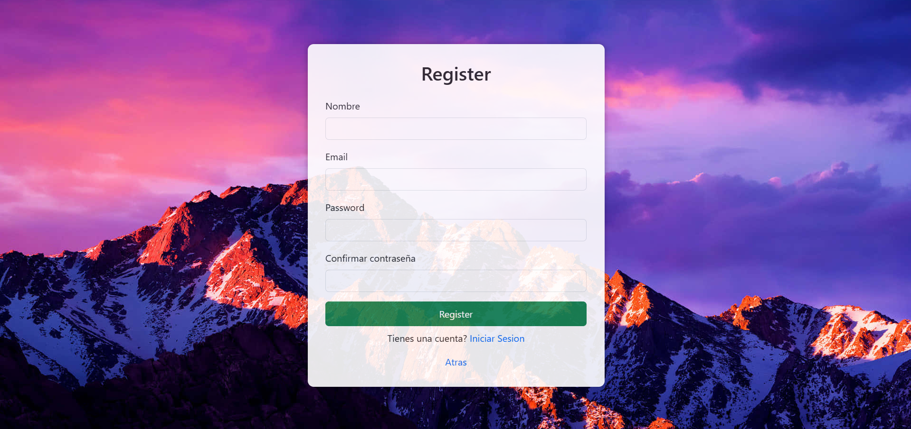
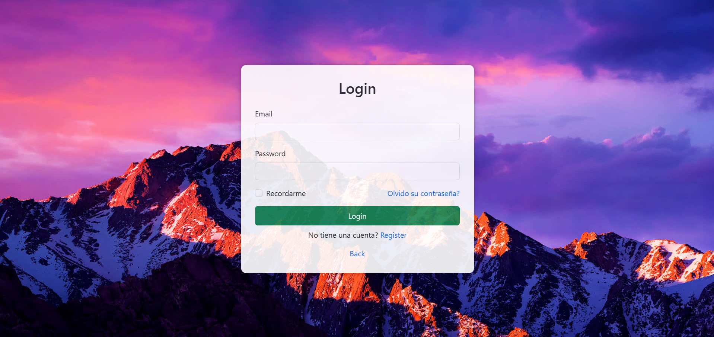
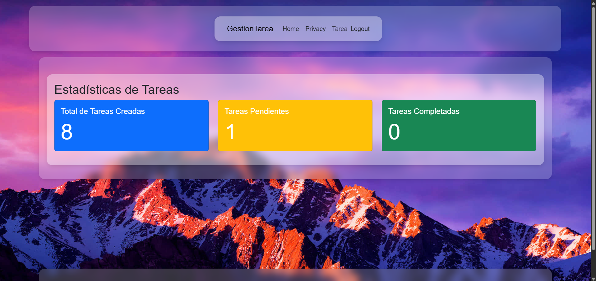
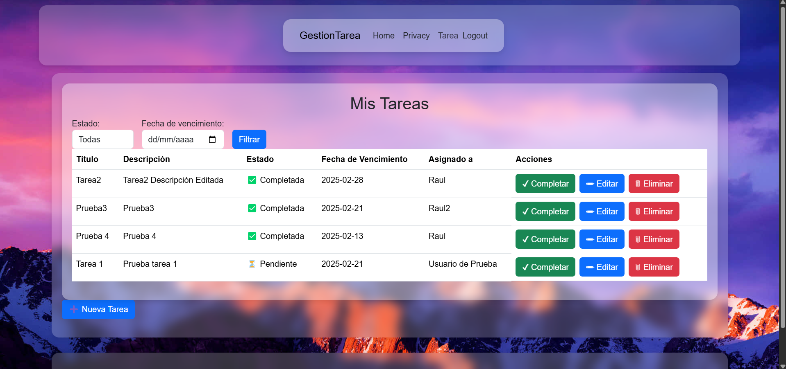

# ASP.NET Gestor de Tareas

Gestor de Tareas que permite a los usuarios gestionar sus tareas de manera eficiente. Cuenta con un sistema de registro y autenticación utilizando Microsoft ASP .NET Identity.

## Características

- Registro e inicio de sesión con correo y contraseña.

- Creación, edición y eliminación de tareas.

- Asignación de tareas a usuarios específicos.

- Solo el usuario asignado puede cambiar el estado o eliminar su tarea.

- Estadísticas en la pantalla principal:

    - Cantidad total de tareas creadas.

    - Cantidad de tareas pendientes del usuario autenticado.

    - Cantidad de tareas completadas del usuario autenticado.
## Tecnologías Utilizadas

- ASP.NET 9

- Microsoft.AspNetCore.Identity.EntityFrameworkCore

- Microsoft.EntityFrameworkCore.SqlServer

- Microsoft.EntityFrameworkCore.Tools

- Bootstrap


## Requisitos

Antes de ejecutar el proyecto, asegúrate de tener instalados:

.NET 9 SDK

SQL Server

SQL Server Management Studio (SSMS) (Opcional, pero recomendado)
## Instalación

1. Clonar el repositorio

```git clone <URL_DEL_REPOSITORIO>```

```cd <NOMBRE_DEL_PROYECTO>```

2. Restaurar dependencias

Ejecuta el siguiente comando para instalar las dependencias necesarias:

```dotnet restore```

4. Configurar la base de datos

Si necesitas aplicar las migraciones de la base de datos, usa los siguientes comandos:

```dotnet ef migrations add Init```

```dotnet ef database update```

Esto creará la base de datos en SQL Server con la estructura necesaria.

5. Ejecutar la aplicación

Inicia el servidor de desarrollo con:

```dotnet run```

La aplicación estará disponible en https://localhost:5001 o http://localhost:5000.
## Base de Datos

El sistema utiliza SQL Server como base de datos.
Cuenta con las tablas: 
- Tarea
- Usuario
## Credenciales de Prueba
Para probar el sistema, se pueden utilizar las siguientes credenciales:

Correo: prueba@prueba.com

Contraseña: Prueba123+-
## Que podemos hacer?

1) Crear una nueva tarea y asignarla al usuario que deseemos.

2) Editar tareas existentes (todos los usuarios pueden editar).

3) Marcar tareas como completadas (solo el usuario asignado puede hacerlo).

4) Eliminar tareas (solo el usuario asignado puede hacerlo).

5) Ver estadísticas de tareas en la pantalla principal.

## Preview




